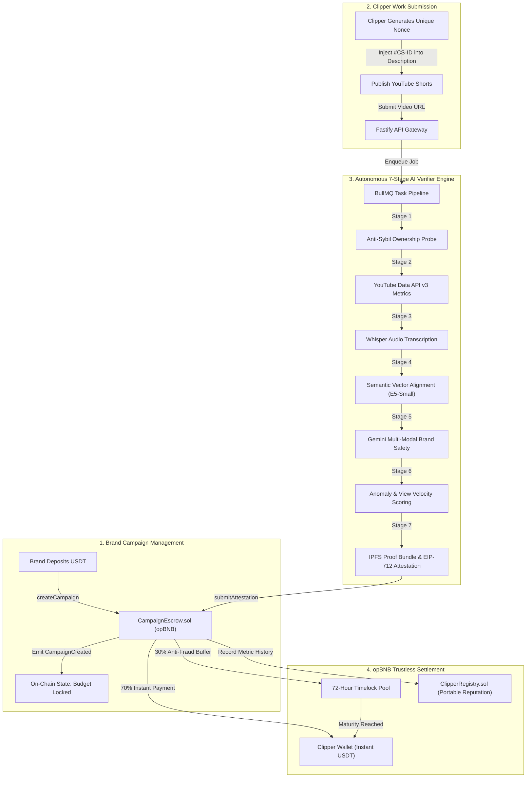
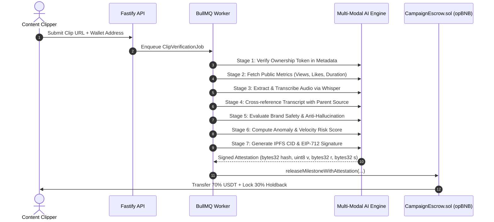

# ClipStream AI: Autonomous AI Verification & Trustless Escrow Protocol for Video Creators

-F0B90B?style=for-the-badge&logo=binance&logoColor=black)


---

## 1. Executive Summary

ClipStream AI is an autonomous, decentralized escrow and verification protocol built on opBNB that transforms how brands sponsor short-form video content creators (*clippers*). 

In traditional digital marketing and centralized Web2 clipping platforms, brands face rampant view inflation, unverified re-uploads, and copyright infringements. Conversely, content clippers endure high withdrawal minimums, subjective admin audits, 7-to-14 day payout delays, and arbitrary balance clawbacks.

ClipStream AI replaces subjective human mediation with an autonomous, multi-modal AI Verification Agent paired with an immutable on-chain escrow contract on opBNB:
1. **Immutable Terms & Budget Locking**: Brands deposit campaign reward pools directly into `CampaignEscrow.sol`. CPM rates, minimum view thresholds, and max payout caps are locked on-chain and cannot be manipulated unilaterally.
2. **7-Stage Multi-Modal AI Auditing**: Submitted video clips undergo rigorous, automated scrutiny within 45 seconds—combining Whisper speech-to-text audio transcription, vector-based semantic matching against parent footage, multi-modal brand safety assessment (via Google Gemini & NVIDIA NIM), and anomaly filtering.
3. **Trustless Milestone Settlement (70/30)**: Once the AI Agent generates an off-chain cryptographic attestation (EIP-712), 70% of accrued earnings are instantly released to the creator's wallet on opBNB, while a 30% buffer is locked in a 72-hour timelock to guarantee metric retention and disincentivize post-payout deletion.

---

## 2. System Architecture



---

## 3. The 7-Stage Autonomous AI Verification Pipeline

The verification engine functions as an autonomous validator node that assesses compliance, audio fidelity, and viral integrity before issuing execution rights to smart contracts.



### Detailed Breakdown of Pipeline Stages

| Stage | Name | Technology | Functional Mechanism & Guarantees |
|---|---|---|---|
| **01** | **Ownership Proof** | Metadata Parser | Validates the presence of the dynamic cryptographic token (e.g., `#CS-a7b9c2`) in the video description, preventing malicious clippers from claiming third-party videos. |
| **02** | **Public Metrics** | YouTube Data API v3 | Fetches canonical view count, engagement statistics, and publication timestamp. Validates minimum view thresholds (e.g., 1,000 views) and duration constraints (15s - 60s). |
| **03** | **Audio Extraction** | Whisper ASR | Extracts the audio stream from the video, generates time-aligned text transcriptions, and computes spectral acoustic fingerprints to prevent unauthorized sound manipulation. |
| **04** | **Semantic Alignment** | Vector Embeddings | Computes cosine similarity between the clip's transcript and the brand's master source video chunks. Enforces a strict minimum threshold (>= 0.70) to ensure high topical fidelity. |
| **05** | **Brand Safety** | Gemini 2.5 / Groq / NIM | Conducts multi-modal content safety inspection against hate speech, profanity, competitor promotion, and prompt injection attacks. Evaluates watermark visibility and mandatory disclosure hashtags. |
| **06** | **Anomaly Engine** | Heuristic Statistical Model | Evaluates like-to-view ratios, comment density, and velocity curves to identify unnatural traffic spikes and flag view-botting anomalies. |
| **07** | **Attestation Signer** | EIP-712 Private Key Node | Compiles all audit outputs into a tamper-proof IPFS evidence bundle, hashes the payload, and produces a cryptographically signed EIP-712 attestation for on-chain consumption. |

---

## 4. Smart Contract Architecture (opBNB)

The on-chain layer is built using Solidity `0.8.24` and deployed on opBNB to leverage sub-cent gas fees and sub-second block finality.

### Contract Modules

1. **`CampaignEscrow.sol`**:
   - Manages brand campaign deposits in BEP-20 stablecoins (e.g., MockUSDT / USDT).
   - Enforces campaign configurations (budget ceiling, CPM rates, minimum views, maximum earnings cap per clip).
   - Validates EIP-712 signatures originating strictly from the authorized AI Verifier Agent.
   - Enforces the 70/30 split: 70% immediate transfer to the clipper; 30% retained in escrow for 72 hours.
   - Includes emergency pausing (`ReentrancyGuardUpgradeable`, owner timelocks).

2. **`ClipperRegistry.sol`**:
   - Maintains a decentralized, portable track record of clipper credentials.
   - Tracks total verified campaigns completed, lifetime view output, and violation marks.
   - Enables trust-tiered benefits: established creators receive lower holdback durations and priority processing.

### Attestation EIP-712 Type Definition

```solidity
struct VerificationAttestation {
    bytes32 clipId;
    address clipperAddress;
    uint256 campaignId;
    uint256 verifiedViews;
    uint256 payoutAmount;
    uint256 holdbackAmount;
    bytes32 evidenceHash; // IPFS CID SHA-256 hash
    uint256 nonce;
    uint256 deadline;
}
```

---

## 5. Comparative Advantage: Web2 Platforms vs. ClipStream AI

| Dimension | Legacy Web2 Clipping Platforms | ClipStream AI Protocol |
|---|---|---|
| **Custody of Funds** | Stored in private platform bank accounts | Locked in public smart contracts on opBNB |
| **Auditing Mechanism** | Manual human review or opaque admin panel | Deterministic 7-stage Multi-Modal AI pipeline |
| **Audit Turnaround** | 3 to 14 business days | 30 to 45 seconds |
| **Payout Mechanics** | Batch bank transfers / high minimum fees | Instant on-chain streaming (USDT on opBNB) |
| **Post-Payout Clawbacks**| Platform reserves right to seize balances | Cryptographically enforced 70/30 holdback |
| **Creator Reputation** | Trapped inside isolated walled gardens | Portable, composable on-chain record |
| **Gas Fee Friction** | N/A (subject to heavy platform commission) | Negligible (< $0.001) on opBNB Layer 2 |

---

## 6. Security, Threat Mitigation, and Anti-Fraud Matrix

| Attack Vector | Vector Description | Protocol Defense Mechanism |
|---|---|---|
| **Replay / Sybil Submission** | Submitting the same viral video to multiple campaigns or from multiple accounts | Unique campaign-specific hash token required in video description; on-chain tracking of clip URLs. |
| **Off-Topic / Clickbait Video** | Submitting high-view videos completely unrelated to brand content | Stage 4 semantic embedding alignment rejects clips with cosine similarity score < 0.70. |
| **Signature Replay Attack** | Intercepting a valid attestation and submitting it multiple times | Monotonically incrementing per-clip on-chain nonces and strict deadline timestamps. |
| **Post-Payout Video Deletion** | Clipper deletes video immediately upon receiving compensation | 30% reward holdback held for 72 hours; if deleted prematurely, holdback is forfeited back to campaign. |
| **View Bot Manipulation** | Buying artificial fake views to artificially inflate milestone payouts | Stage 6 anomaly detection flags abnormal engagement distribution; holdback buffer absorbs sudden metric drops. |
| **Prompt Injection via Title/Tags**| Embedding adversarial instructions into video description to fool AI agent | Strict input sanitization; system instructions isolated from user data payloads; temperature fixed to 0.0. |

---

## 7. Technology Stack

- **Blockchain Infrastructure**: opBNB (Layer 2 on BNB Chain), Solidity 0.8.24, Foundry Test Suite.
- **AI & Computer Vision**: Google Gemini 2.5 Flash, Whisper ASR, NVIDIA NIM, Multilingual-E5 Embeddings.
- **Backend & Queue**: Node.js, Fastify, TypeScript, BullMQ, Redis, PostgreSQL, Drizzle ORM.
- **Frontend & Client**: Next.js 15 (App Router), Tailwind CSS, Wagmi / Viem, Privy Embedded Wallets.
- **Decentralized Storage**: IPFS (Pinata) for immutable verification audit trails.

---

## 8. Deployment & Live Verification Artifacts

- **Live Web Application**: [https://clipstreamai.biz.id](https://clipstreamai.biz.id)
- **GitHub Repository**: [https://github.com/fahmi418/Clipstream-AI](https://github.com/fahmi418/Clipstream-AI)
- **Network**: opBNB Testnet (Chain ID: `5611`)
- **CampaignEscrow Contract**: `0xdd98b26cab175aa47c128c1f893e9b95d7cb27b1`
- **ClipperRegistry Contract**: `0x929cea9bbf93c979ef8ee3ce04d8292cfaf652ea`
- **Block Explorer**: [https://testnet.opbnbscan.com/address/0xdd98b26cab175aa47c128c1f893e9b95d7cb27b1](https://testnet.opbnbscan.com/address/0xdd98b26cab175aa47c128c1f893e9b95d7cb27b1)
